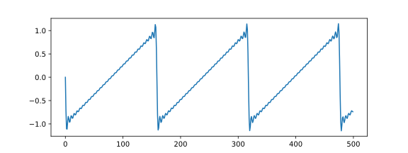
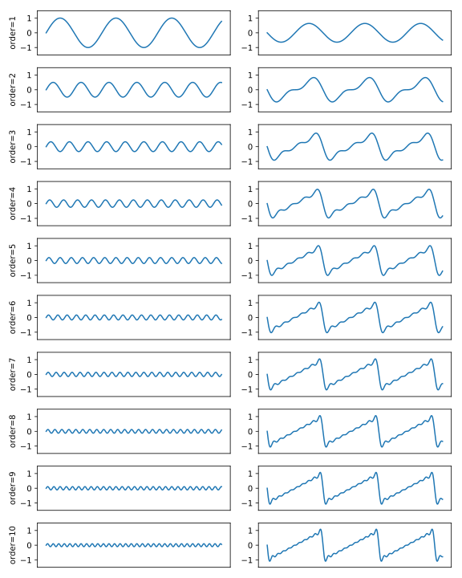
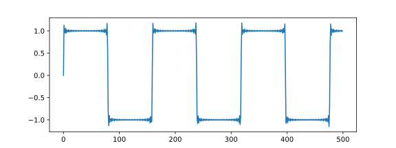
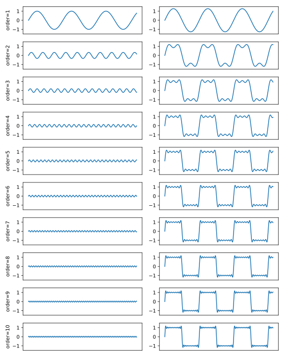
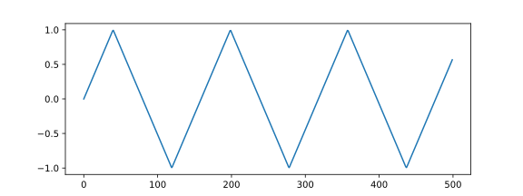
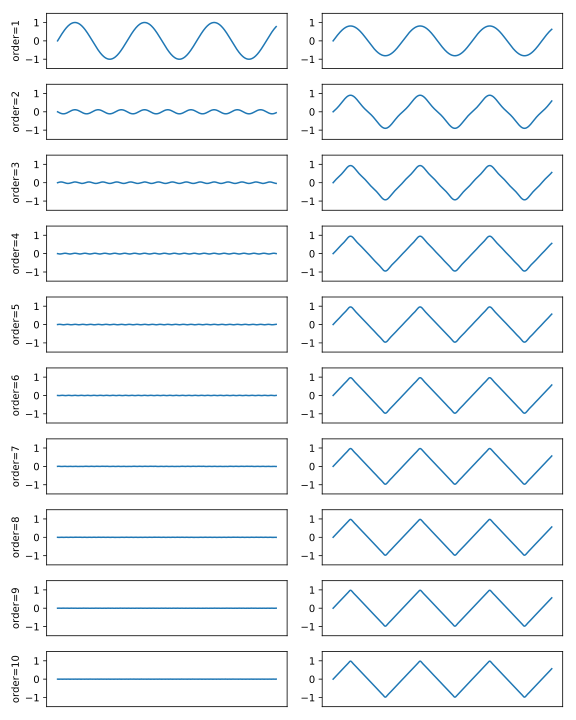

Additive synthesis is the process of approximating waveforms by adding
sine waves together.  In this article, I provide some examples of how
specific waveforms can be composed using this method.

## Sawtooth

### Equation

A sawtooth waveform can be represented by the following equation:

$$
x_\mathrm{sawtooth}(t) = -\frac {A}{\pi}\sum_{k=1}^{\infty}\frac {\sin (2\pi kft)}{k} 
$$

Where $A$ is the amplitude, $f$ is the frequency of the desired
waveform, $k$ is the *order*, or number of harmonics to use for the
approximation, and $t$ is time.

### Code

Using [NumPy][] we can perform a relatively straightforward
translation of the above equation into the following Python code:

[numpy]: http://www.numpy.org/

```python
>>> from numpy import pi, sin, linspace
>>> order = 30
>>> t = linspace(0, pi, 500)
>>> waveform = -(2/pi) * sum([
...     sin(2 * pi * k * t)/k
...     for k in range(1, (order+2))
... ])
>>>
```

### Result

The above code results in:



### Steps

The following figure shows the result of each successive step as $k$
iterates from 1 to 10.



## Square

### Equation

$$
x_{\mathrm{square}}(t) = \frac{4}{\pi} \sum_{k=1}^\infty
{\sin{\left (2\pi (2k-1) ft \right )}\over(2k-1)}
$$

### Code

```python
>>> from numpy import pi, sin, linspace
>>> order = 30
>>> t = linspace(0, pi, 500)
>>> waveform = (4/pi) * sum([
...   sin(2 * pi * (2 * k - 1) * t)/(2 * k - 1)
...   for k in range(1, (order+2))
... ])
>>>
```

### Result



### Steps



## Triangle

### Equation

$$
x_\mathrm{triangle}(t) = \frac {8}{\pi^2} \sum_{k=0}^\infty (-1)^k \, \frac{ \sin \left( 2\pi(2k+1) ft \right)}{(2k+1)^2}
$$

### Code

```python
>>> from numpy import pi, sin, linspace
>>> order = 30
>>> t = linspace(0, pi, 500)
>>> waveform = (8/pi**2) * sum([
...   (-1)**k *
...   sin(2 * pi * (2 * k + 1) * t)/(2 * k + 1)**2
...   for k in range(0, (order+1))
... ])
>>>
```

### Result



### Steps



